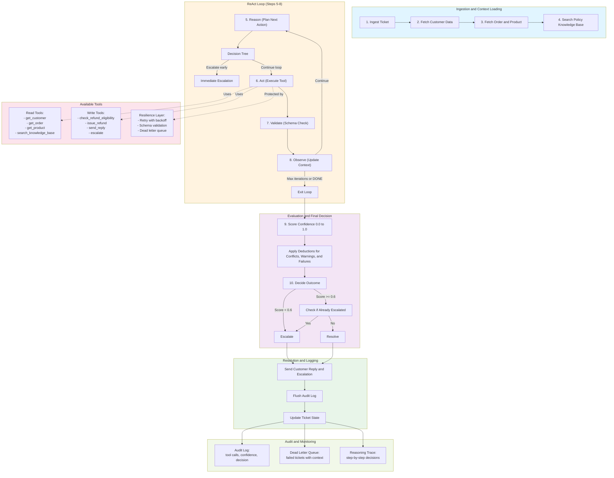

## Architecture Diagram

```mermaid
graph TB
    subgraph Ingestion["Ingestion and Context Loading"]
        A["1. Ingest Ticket"] --> B["2. Fetch Customer Data"]
        B --> C["3. Fetch Order and Product"]
        C --> D["4. Search Policy Knowledge Base"]
    end

    subgraph ReActLoop["ReAct Loop (Steps 5-8)"]
        E["5. Reason (Plan Next Action)"] --> F["Decision Tree"]
        F -->|Escalate early| G["Immediate Escalation"]
        F -->|Continue loop| H["6. Act (Execute Tool)"]
        H --> I["7. Validate (Schema Check)"]
        I --> J["8. Observe (Update Context)"]
        J -->|Max iterations or DONE| K["Exit Loop"]
        J -->|Continue| E
    end

    subgraph Evaluation["Evaluation and Final Decision"]
        K --> L["9. Score Confidence 0.0 to 1.0"]
        L --> M["Apply Deductions for Conflicts, Warnings, and Failures"]
        M --> N["10. Decide Outcome"]
        N -->|Score < 0.6| O["Escalate"]
        N -->|Score >= 0.6| P["Check if Already Escalated"]
        P -->|Yes| O
        P -->|No| Q["Resolve"]
    end

    subgraph Resolution["Resolution and Logging"]
        O --> R["Send Customer Reply and Escalation"]
        Q --> R
        R --> S["Flush Audit Log"]
        S --> T["Update Ticket State"]
    end

    subgraph Tools["Available Tools"]
        U["Read Tools:<br/>- get_customer<br/>- get_order<br/>- get_product<br/>- search_knowledge_base"]
        V["Write Tools:<br/>- check_refund_eligibility<br/>- issue_refund<br/>- send_reply<br/>- escalate"]
        W["Resilience Layer:<br/>- Retry with backoff<br/>- Schema validation<br/>- Dead letter queue"]
    end

    subgraph Logging["Audit and Monitoring"]
        X["Audit Log:<br/>tool calls, confidence, decision"]
        Y["Dead Letter Queue:<br/>failed tickets with context"]
        Z["Reasoning Trace:<br/>step-by-step decisions"]
    end

    H -.->|Uses| U
    H -.->|Uses| V
    H -.->|Protected by| W
    T --> X
    T --> Y
    T --> Z

    style Ingestion fill:#e1f5ff
    style ReActLoop fill:#fff3e0
    style Evaluation fill:#f3e5f5
    style Resolution fill:#e8f5e9
    style Tools fill:#fce4ec
    style Logging fill:#f1f8e9
```
